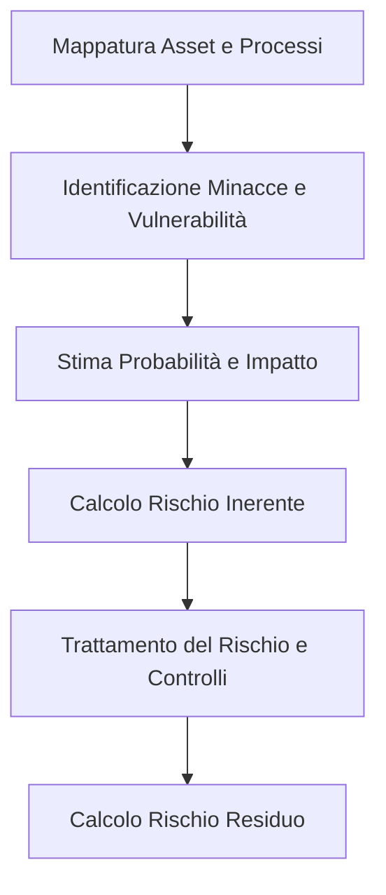

# Metodologia di Analisi dei Rischi e Framework di Audit — Lepida SpA (SIMULATO)

**Codice Documento:** PX-SEC-RAM-005  
**Versione:** 2.0  
**Classificazione:** Riservato (C3)  
**Destinatari:** Risk Manager, Internal Auditor, Direzione Generale, Comitato di Sicurezza  

---

## 1. Introduzione e Obiettivo
Il presente documento descrive la metodologia adottata da Lepida SpA per identificare, analizzare, valutare e trattare i rischi per la sicurezza dei sistemi informativi e di rete, in linea con l'Art. 24 comma 2 lettera a) (politiche di analisi dei rischi) e lettera f) (politiche e procedure per valutare l'efficacia delle misure) del D.Lgs. 138/2024 (NIS2).  
Il framework definisce inoltre le modalità di esecuzione degli audit interni ed esterni di conformità.

---

## 2. Metodologia di Analisi dei Rischi

Lepida adotta un approccio quantitativo e qualitativo basato sulle linee guida dello standard **ISO/IEC 27005** e del Framework Nazionale per la Cybersecurity e la Privacy.

### 1. Calcolo del Rischio
Il livello di rischio ($R$) per ciascun asset critico è calcolato come combinazione del valore di **Probabilità ($P$)** di accadimento di una minaccia e del valore di **Impatto ($I$)** della compromissione (perdita di riservatezza, integrità o disponibilità):

$$R = P \times I$$

*   **Probabilità ($P$):** Valutata su una scala da 1 (Molto bassa - evento raro) a 5 (Molto alta - quasi certo). Si tiene conto dello storico degli attacchi, dei report di intelligence e della presenza di vulnerabilità note non patchate.
*   **Impatto ($I$):** Valutato su una scala da 1 (Irrilevante) a 5 (Catastrofico). L'impatto considera il danno economico, le sanzioni regolatorie, il danno reputazionale per la Regione Emilia-Romagna e la salute/sicurezza dei cittadini.

### 2. Matrice del Rischio e Soglie di Accettazione

*   **Rischio < 6 (Basso):** Rischio accettato. Nessuna misura aggiuntiva richiesta oltre ai controlli base.
*   **Rischio 6 - 12 (Medio):** Richiede l'implementazione di controlli di mitigazione entro l'esercizio in corso.
*   **Rischio > 12 (Alto):** Rischio non accettabile. È obbligatorio avviare un piano di trattamento immediato con autorizzazione esplicita della Direzione Generale per l'accettazione del rischio residuo temporaneo.

---

## 3. Framework di Audit e Valutazione dell'Efficacia

Per misurare l'efficacia reale delle misure tecniche e organizzative adottate, Lepida implementa un programma di controllo strutturato su tre livelli:

### Livello 1: Autovalutazione Continua (Self-Assessment)
*   **Frequenza:** Trimestrale.
*   **Attività:** I proprietari degli asset (Asset Owners) compilano checklist tecniche per verificare il rispetto delle policy interne (es. rotazione chiavi crittografiche, revoca delle utenze dei dipendenti dimessi, presenza di log completi).

### Livello 2: Audit Interni (Internal Audit)
*   **Frequenza:** Annuale.
*   **Attività:** Condotti dal team interno di Risk & Compliance (indipendente dai team operativi IT). L'audit verifica l'aderenza del Sistema di Gestione della Sicurezza delle Informazioni (SGSI) agli standard ISO 27001 e NIS2. L'esito viene formalizzato nel **Rapporto di Audit Interno** presentato al Comitato di Sicurezza.

### Livello 3: Audit Esterni e Penetration Test (Vulnerabilità e Robustezza)
*   **Frequenza:** Minimo annuale (o ad ogni aggiornamento critico dei sistemi).
*   **Attività:** 
    *   **External Audit:** Svolti da un Organismo di Certificazione terzo accreditato per il rinnovo della certificazione ISO 27001.
    *   **Penetration Testing:** Attività di "Red Teaming" ed hacking etico condotta da aziende di sicurezza specializzate esterne sui canali critici (es. interfaccia pubblica di LepidaID, endpoint API del Cloud Regionale).
    *   **Scansioni di Sicurezza ACN:** Esecuzione di scansioni e analisi su richiesta o in collaborazione con l'Autorità Nazionale (ACN) ai sensi dell'Art. 34 del D.Lgs. 138/2024.
*   **Tracciamento delle Non Conformità:** I rilievi (Non Conformità Maggiori, Minori, Osservazioni) emersi dagli audit vengono registrati in un registro aziendale e associati ad azioni correttive con un responsabile incaricato e una data di scadenza per la risoluzione.
