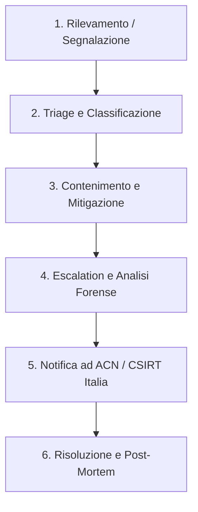

# Piano di Gestione degli Incidenti di Sicurezza (Incident Response Plan) — Lepida SpA (SIMULATO)

**Codice Documento:** PX-SEC-IRP-001  
**Versione:** 3.1  
**Classificazione:** Riservato (C3)  
**Destinatari:** Security Operations Center (SOC), Incident Response Team (IRT), Direzione IT, RTD  

---

## 1. Obiettivo e Ambito di Applicazione
Il presente documento descrive le procedure operative adottate da Lepida SpA per il rilevamento, la classificazione, l'escalation, il contenimento, la risoluzione e la notifica degli incidenti di sicurezza informatica.  
Il piano si applica a tutti i sistemi informativi, le reti di connettività regionale (Rete Lepida), il Cloud Regionale e i servizi erogati (es. LepidaID, conservazione digitale, PEC).

---

## 2. Processo Operativo di Incident Response

### Fase 1: Rilevamento e Segnalazione
Gli incidenti possono essere rilevati tramite:
*   Sistemi automatici di monitoraggio (SIEM/EDR/XDR) gestiti dal **SOC (Security Operations Center)** h24.
*   Segnalazioni interne da parte dei dipendenti (tramite portale di ticketing interno).
*   Segnalazioni esterne da parte degli Enti Soci (Comuni, ASL, Regione) o utenti finali tramite Service Desk.

### Fase 2: Triage e Classificazione
Il SOC effettua l'analisi preliminare dell'allarme entro **15 minuti** dalla ricezione per confermare la presenza di un incidente reale e assegnare la gravità secondo la tabella seguente:

| Gravità | Definizione | Esempio |
|---|---|---|
| **Critico (P1)** | Interruzione totale di un servizio essenziale o compromissione di dati sensibili su larga scala. | Ransomware attivo sul Cloud Regionale, indisponibilità totale di LepidaID. |
| **Alto (P2)** | Compromissione parziale di un servizio critico o accesso non autorizzato a sistemi sensibili senza esfiltrazione confermata. | Compromissione di un singolo server applicativo PA senza dati sanitari, DDOS parziale. |
| **Medio (P3)** | Compromissione di sistemi di supporto o tentativi di attacco andati a buon fine ma circoscritti. | Compromissione della postazione di lavoro di un dipendente senza privilegi amministrativi. |
| **Basso (P4)** | Eventi di sicurezza isolati, malfunzionamenti minori o falsi positivi. | Tentativi di brute-force bloccati automaticamente dai firewall. |

### Fase 3: Contenimento e Mitigazione
Una volta classificato l'incidente come P1 o P2, l'**Incident Response Team (IRT)** assume il controllo delle operazioni:
*   **Isolamento logico:** Disconnessione delle reti infette, blocco delle porte compromesse, isolamento delle macchine virtuali affette.
*   **Preservazione delle prove:** Creazione di snapshot dei sistemi e dump della memoria RAM prima dello spegnimento delle macchine, per consentire l'analisi forense.

---

## 3. Workflow di Notifica all'Autorità Nazionale (ACN / CSIRT Italia)

Ai sensi del D.Lgs. 138/2024 (NIS2), gli incidenti definiti **"Significativi"** devono essere notificati secondo scadenze imperative. Un incidente è significativo se ha causato una grave perturbazione operativa o perdite finanziarie, o se ha impatto transfrontaliero.

### Tempistiche di Invio delle Segnalazioni

1.  **Pre-notifica (Early Warning) — Entro 24 ore:**
    *   Inviata via PEC o portale ACN entro 24 ore dalla conoscenza dell'incidente.
    *   *Contenuto:* Descrizione sommaria dell'evento, indicazione se si sospetta un'azione malevola/attacco informatico e se vi è un potenziale impatto transfrontaliero.
2.  **Notifica dell'incidente — Entro 72 ore:**
    *   Inviata entro 72 ore dalla conoscenza.
    *   *Contenuto:* Aggiornamento dettagliato sulla gravità, sugli Indicatori di Compromissione (IoC) rilevati, sull'impatto stimato e sulle prime misure di contenimento intraprese.
3.  **Relazione Finale — Entro 1 mese:**
    *   Inviata entro 30 giorni dalla risoluzione.
    *   *Contenuto:* Analisi dettagliata della causa principale (Root Cause Analysis), descrizione dell'impatto effettivo sui dati e sui servizi, e misure correttive permanenti implementate per evitare la ricorrenza dell'evento.

---

## 4. Gestione della Comunicazione verso gli Interessati (Data Breach)
Se l'incidente comporta una perdita di riservatezza, integrità o disponibilità di dati personali:
*   Il DPO (Data Protection Officer) di Lepida notifica il **Garante per la Protezione dei Dati Personali entro 72 ore** (ex Art. 33 GDPR).
*   Se la violazione presenta un rischio elevato per i diritti delle persone fisiche, Lepida provvede alla **comunicazione tempestiva a tutti gli utenti interessati** (es. cittadini con identità LepidaID compromessa), fornendo indicazioni chiare su come proteggersi (es. cambio password immediato).
