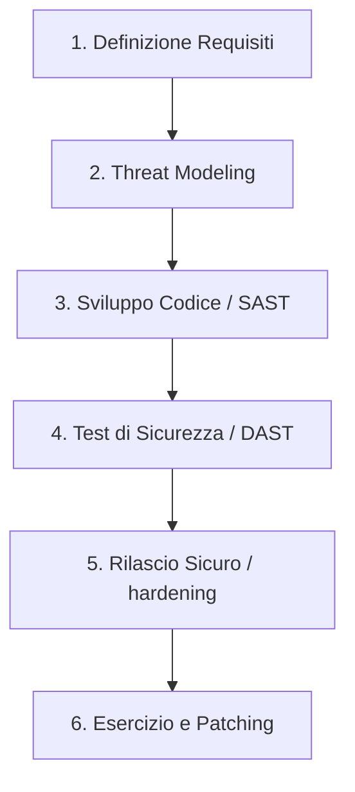

# Policy di Gestione delle Vulnerabilità e Sviluppo Sicuro (SDLC) — Lepida SpA (SIMULATO)

**Codice Documento:** PX-SEC-VMS-004  
**Versione:** 2.1  
**Classificazione:** Riservato (C3)  
**Destinatari:** Software Development Team, DevOps Engineers, System Administrators, Security Team  

---

## 1. Obiettivo e Quadro di Riferimento
In conformità al D.Lgs. 138/2024 (NIS2) — specificamente l'Art. 24 comma 2 lettera e) (sicurezza dell'acquisizione, dello sviluppo e manutenzione dei sistemi) e l'Art. 16 (divulgazione coordinata delle vulnerabilità) — Lepida SpA implementa la presente policy per disciplinare la ricerca, classificazione e risoluzione delle falle di sicurezza nei propri sistemi e garantire un ciclo di sviluppo software privo di vulnerabilità note fin dalla progettazione.

---

## 2. Processo di Sviluppo Software Sicuro (Secure SDLC)

Lepida adotta l'approccio **"Security by Design and by Default"** nell'intero ciclo di vita del software sviluppato internamente o commissionato all'esterno.

### Controlli nelle Fasi di Sviluppo
*   **Analisi dei Requisiti & Threat Modeling:** Definizione dei requisiti di sicurezza (es. controlli di autenticazione e autorizzazione) e identificazione delle minacce potenziali prima della scrittura del codice.
*   **Analisi Statica del Codice (SAST):** Integrazione nei processi CI/CD (DevSecOps) di strumenti automatici per la scansione del codice sorgente ad ogni commit, bloccando il build in caso di rilevamento di debolezze note (es. SQL Injection, Cross-Site Scripting, hardcoded credentials). Le linee guida di sviluppo fanno riferimento agli standard **OWASP Top 10**.
*   **Analisi Dinamica e Penetration Test (DAST):** Prima di ogni rilascio in ambiente di produzione, le applicazioni web vengono sottoposte a test dinamici automatizzati e a attività manuali di verifica da parte del team interno di cybersecurity.

---

## 3. Gestione e Patching delle Vulnerabilità Infrastrutturali

Il team di sicurezza di Lepida effettua scansioni periodiche di sicurezza (**Vulnerability Assessment**) su tutta la rete e su tutti gli endpoint, per identificare porte aperte, configurazioni errate e software non aggiornato.

### Classificazione CVE e Tempi Massimi di Patching
Le vulnerabilità riscontrate vengono classificate in base al punteggio **CVSS v3 (Common Vulnerability Scoring System)**. Lepida si impegna ad applicare gli aggiornamenti di sicurezza (patch) o a implementare misure di mitigazione compensative entro le seguenti tempistiche:

| Gravità | Punteggio CVSS | Tempi di Risoluzione | Esempio |
|---|---|---|---|
| **Critica** | 9.0 – 10.0 | **Entro 72 ore** | RCE su server web esposto, vulnerabilità zero-day attive. |
| **Alta** | 7.0 – 8.9 | **Entro 14 giorni** | Priviledge escalation locale su sistemi critici. |
| **Media** | 4.0 – 6.9 | **Entro 30 giorni** | Informazioni sensibili esposte in intestazioni HTTP. |
| **Bassa** | 0.1 – 3.9 | **Entro 90 giorni** | Fingerprinting software non critico. |

---

## 4. Programma di Divulgazione Coordinata delle Vulnerabilità (VDP)
Lepida supporta il principio della divulgazione etica e coordinata delle vulnerabilità (Coordinated Vulnerability Disclosure - CVD), fungendo da interfaccia con il **CSIRT Italia** (ex Art. 16 D.Lgs. 138/2024).

*   **Canale di Segnalazione Pubblico (Security.txt):** Lepida pubblica nel file `https://www.lepida.it/.well-known/security.txt` le istruzioni e la chiave PGP per consentire a ricercatori di sicurezza indipendenti ("ethical hackers") di segnalare in modo sicuro e confidenziale vulnerabilità riscontrate sui servizi online di Lepida.
*   **Gestione della Segnalazione:**
    *   **Triage (entro 5 giorni lavorativi):** Il team di sicurezza valida la segnalazione e fornisce un riscontro iniziale al segnalatore.
    *   **Risoluzione (entro 90 giorni):** Lepida sviluppa ed applica la patch risolutiva prima che i dettagli della vulnerabilità vengano resi pubblici.
    *   **Divulgazione:** Una volta applicata la patch, viene pubblicata una nota informativa di sicurezza ringraziando il ricercatore per la collaborazione.
