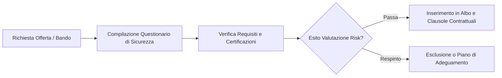

# Procedura per la Sicurezza della Catena di Approvvigionamento (Supply Chain Security) — Lepida SpA (SIMULATO)

**Codice Documento:** PX-SEC-SCS-003  
**Versione:** 1.8  
**Classificazione:** Riservato (C3)  
**Destinatari:** Ufficio Acquisti e Contratti, Security Team, Responsabili di Progetto (RUP)  

---

## 1. Introduzione e Obiettivi
In conformità all'Art. 24 comma 2 lettera d) del D.Lgs. 138/2024 (NIS2), Lepida SpA stabilisce una procedura codificata per identificare, valutare e mitigare i rischi di sicurezza informatica associati all'acquisto di beni, soluzioni e servizi ICT forniti da soggetti terzi.  
Il controllo della catena di approvvigionamento è finalizzato a prevenire attacchi veicolati tramite vulnerabilità presenti nei prodotti forniti o falle di sicurezza nei sistemi dei partner commerciali.

---

## 2. Processo di Qualifica dei Fornitori ICT

Qualsiasi fornitore che intenda partecipare a gare d'appalto o affidamenti diretti per la fornitura di beni o servizi tecnologici a Lepida deve essere sottoposto a un processo preliminare di qualifica in ambito cybersecurity.

### Requisiti Minimi Richiesti (Certificazioni)
I fornitori di servizi critici (es. manutenzione software, servizi cloud, consulenza infrastrutturale) devono dimostrare il possesso delle seguenti certificazioni internazionali in corso di validità:
*   **ISO/IEC 27001:** Per i servizi di gestione e manutenzione delle infrastrutture informative.
*   **ISO/IEC 27017 e 27018:** Obbligatorie per tutti i fornitori di soluzioni Cloud (SaaS, PaaS, IaaS) destinate alla PA regionale.
*   **ISO 22301 (raccomandata):** Per fornitori di servizi di connettività o supporto operativo.

---

## 3. Questionario di Autovalutazione Cybersecurity (Vendor Security Assessment)

Il fornitore deve compilare un modulo di autocertificazione comprendente 10 controlli chiave di sicurezza:
1.  **Politiche di Sicurezza:** Esistenza di una politica aziendale di sicurezza delle informazioni formalizzata e approvata dalla direzione.
2.  **Sicurezza delle Risorse Umane:** Esecuzione di background checks sul personale tecnico che avrà accesso ai sistemi Lepida e accordi di riservatezza (NDA) firmati.
3.  **Gestione degli Asset:** Inventario formale degli asset informatici aziendali e politiche di classificazione dei dati.
4.  **Controllo degli Accessi:** Utilizzo obbligatorio dell'autenticazione a più fattori (MFA) per tutti gli accessi amministrativi e remoti (VPN).
5.  **Crittografia:** Utilizzo di algoritmi di cifratura forti (AES-256) per la protezione dei dati a riposo e in transito (TLS 1.3).
6.  **Sicurezza Fisica:** Misure di protezione degli uffici e dei server locali (antintrusione, videosorveglianza, controllo accessi elettronico).
7.  **Sviluppo Sicuro:** Adozione di metodologie di sviluppo software sicuro (es. OWASP) e test periodici del codice (SAST/DAST) per i fornitori di applicazioni.
8.  **Gestione delle Vulnerabilità:** Processi attivi di vulnerability scanning e patch management (tempi massimi di applicazione patch critiche < 14 giorni).
9.  **Incident Response:** Esistenza di una procedura interna di gestione degli incidenti con obbligo di notifica a Lepida entro **24 ore** in caso di compromissione che possa impattare i sistemi regionali.
10. **Business Continuity:** Presenza di un piano di continuità operativa testato annualmente.

---

## 4. Clausole Contrattuali Obbligatorie (Cybersecurity Annex)
Tutti i contratti di fornitura ICT stipulati da Lepida includono un allegato vincolante contenente le seguenti clausole:
*   **Diritto di Audit (Right to Audit):** Lepida si riserva il diritto di eseguire audit di sicurezza periodici, anche tramite terze parti indipendenti, sui sistemi del fornitore utilizzati per erogare il servizio.
*   **Obbligo di Risoluzione Vulnerabilità:** Il fornitore si impegna a risolvere gratuitamente e con massima priorità qualsiasi vulnerabilità critica rilevata nei prodotti consegnati entro 7 giorni dalla segnalazione.
*   **Penali per Mancata Notifica:** L'omessa o ritardata segnalazione di un incidente di sicurezza che coinvolga i sistemi del fornitore dà diritto a Lepida di applicare penali finanziarie e di risolvere immediatamente il contratto per giusta causa.
*   **Gestione del Fine Vita (Escrow):** Per i software critici sviluppati ad hoc, il fornitore deve depositare il codice sorgente presso un ente terzo (deposito escrow) a garanzia della continuità operativa in caso di fallimento o cessazione dell'attività del fornitore.
